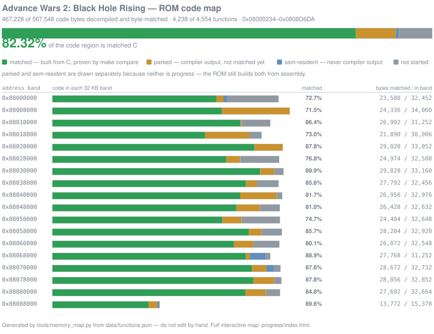

# Advance Wars 2: Black Hole Rising

A **matching decompilation** of *Advance Wars 2: Black Hole Rising* (GBA, US).

"Matching" means the C here is not a remake or a port. It is compiled with the
original toolchain and produces the *same bytes* as the retail cartridge. A
function counts as done only when its compiled output is byte-identical to the
original, and the finished build has to reproduce the retail ROM's checksum:

* **aw2bhr.gba** — `sha1: 14dd0b22c894865867aff89e8116b2dffae25605`
  ([No-Intro entry](https://datomatic.no-intro.org/index.php?page=show_record&s=23&n=1043))



## You must supply your own ROM

**No game data ships with this repository.** Everything the
build needs from the cartridge is pulled out of a copy you provide. Obtain a
legal dump of your own cartridge, put it in the repository root, and name it
`baserom.gba`:

```sh
sha1sum baserom.gba   # must be 14dd0b22c894865867aff89e8116b2dffae25605
```

Any other dump — a different region, revision, or a trimmed/patched image —
will not build.

## Building

Builds run on Linux, or on Windows under WSL. You need GNU `make`, `python3`,
`iconv`, an `arm-none-eabi` binutils, and **agbcc** — Nintendo's GCC 2.95 fork,
which is what the game was compiled with and the only compiler that can
reproduce its code generation. (`make syms` additionally wants `perl`.)

```sh
# Debian/Ubuntu, including a default WSL2 install
sudo apt install build-essential gcc-arm-none-eabi
tools/install-agbcc.sh     # clones and builds pret/agbcc into tools/agbcc
```

### Two builds, one ROM

There are two independent builds, and **both must produce that same SHA1**.

```sh
# 1. upstream's build: every function assembled from asm/*.s
make compare -j

# 2. the decompiled build: promoted functions compiled from C in src/decomp/
rm -f aw2bhr.gba aw2bhr.elf
python3 tools/split_asm.py && python3 tools/split_rodata.py && python3 tools/gen_lds.py
make SPLIT=1 compare -j
```

Both print `aw2bhr.gba: OK` on success. Delete `aw2bhr.gba` and `aw2bhr.elf`
between the two runs, as shown above — both builds write the same file, and
without the delete the second one just re-checks the first one's output.

The two builds are the project's safety net. The first never uses `src/decomp/`,
so it rebuilds the ROM from the original assembly. The second rebuilds the same
ROM with the decompiled C in place. Getting one checksum from two separate
routes is what makes the C trustworthy.

## Progress

Three numbers get quoted for this project. They measure different things, so
they don't match each other. As of **wave 61**:

| metric | value | what it counts |
|---|---|---|
| **index** | **4,123 / 4,554 functions · 447,988 / 567,548 code bytes (78.93%)** | Functions that existed as assembly in `asm/` and are now matched C. The conservative figure, and the one the map above draws. |
| **C definitions** | **4,230** | Function definitions across `src/`. Higher, because `src/proc.c` and `src/title-screen.c` were already C upstream and were never in `asm/`. Commit titles use this one. |
| **linker map** | **4,228 / 4,659 functions · 452,312 / 571,872 bytes (79.09%)** | What `tools/progress_map.py` reports, reading addresses out of `aw2bhr.map`. Also includes the pre-existing C, so its byte total is the largest of the three. |

The index metric is the one to quote as decompilation progress. Two other
states are tracked but not counted, because those functions are still assembly:

* **parked** (109 functions, 30,828 bytes) — compiler output that hasn't been
  matched yet, set aside so it doesn't keep coming back up as new work.
* **asm-resident** (76 functions, 4,060 bytes) — hand-written assembly that was
  never compiled from C, so it won't become C.

A third label, **identified**, marks functions that have been given a name by
comparing them against the public Fire Emblem decompilations. That's useful, but
they're still assembly, so they're listed separately as well.

Only the code region is mapped. The rest of the 8 MB cartridge is still copied
straight from `baserom.gba`.

* `progress/memory-map.svg` — the image above. Regenerate with
  `python3 tools/memory_map.py`.
* `progress/index.html` — the detailed version: one rectangle per function,
  hover for name, address, size and state. Open it locally; GitHub will not
  render it in place. Regenerate with `python3 tools/progress_map.py` after a
  build, since completed functions are read out of `aw2bhr.map`.

## Layout

```
asm/        the original disassembly, 4 files.
data/       .incbin directives into baserom.gba, plus the JSON indexes tools read
docs/       agbcc-codegen.md — how this compiler behaves, learned the hard way
include/    headers: types, hardware, and the structs recovered so far
src/        C. src/decomp/ holds functions promoted out of assembly.
tools/      the pipeline
progress/   generated progress views
```

`asm/` is never edited. Decompiling a function doesn't delete its assembly — the
build just stops using that piece and links the C at the same address instead.
The original stays there for reference, and the assembly-only build keeps
working.

## Tools

| tool | what it does |
|---|---|
| `index_functions.py` | Builds `data/functions.json`, the index of all 4,554 functions — address, size, shape, callees and state. Everything else reads it. |
| `split_asm.py` | Splits the four big `asm/*.s` files into one file per function, so functions can be swapped for C individually. |
| `split_rodata.py` | Removes the constants a decompiled function now provides itself, so they don't end up in the ROM twice. |
| `gen_lds.py` | Writes the linker script that keeps every function at its original address. |
| `verify_split.py` | Checks the split lost nothing, by rebuilding the original `asm/*.s` from the pieces. |
| `trymatch.py` | The verdict. Compiles your C and compares it against the original. Exits 0 only on an exact match. |
| `promote.py` | Moves matched C into `src/decomp/`. Refuses anything `trymatch.py` doesn't accept. |
| `progress_map.py` | Generates `progress/index.html`. |
| `memory_map.py` | Generates `progress/memory-map.svg` for this README. |

If you want to match functions, read `docs/agbcc-codegen.md` first. It collects
what this compiler does and why candidates fail. The usual reason correct-looking
C doesn't match is that a value ended up in a different register, which depends
on how the code is written rather than on what it calculates.

## Contributing

1. Pick a function that is still assembly. `data/functions.json` lists the state,
   size and shape of every one.
2. `python3 tools/newfunc.py sub_0801XXXX` scaffolds `work/<name>/` with the
   target assembly and a stub signature.
3. Write C, then `python3 tools/trymatch.py sub_0801XXXX --diff` until it exits 0.
4. `python3 tools/promote.py sub_0801XXXX`, regenerate the split, and confirm
   **both** builds still reproduce the SHA1.

Please don't send patches that change `asm/`, or that call a function matched on
anything other than `trymatch.py` exiting 0. Naming things — functions, globals,
struct fields — is worth contributing on its own.

## Upstream

This repository is a fork of [**Eebit/aw2bhr**](https://github.com/Eebit/aw2bhr),
which built the disassembly, the linker script, the build and the `make compare`
check that everything here depends on. `asm/` is still identical to upstream and
is never edited, so changes merge cleanly in both directions. 

What this fork adds is the per-function split, the matching tools, and the C in `src/decomp/`.

Related projects, useful both for the approach and for shared library code:

* [**FireEmblemUniverse/fireemblem8u**](https://github.com/FireEmblemUniverse/fireemblem8u) — Fire Emblem: The Sacred Stones (US)
* [**FireEmblemUniverse/fireemblem6j**](https://github.com/FireEmblemUniverse/fireemblem6j) — Fire Emblem: The Binding Blade
* [**MokhaLeee/FireEmblem7J**](https://github.com/MokhaLeee/FireEmblem7J) — Fire Emblem: Rekka no Ken (JP)
* [**StanHash/fe7_us**](https://github.com/StanHash/fe7_us) — Fire Emblem (US)
* [**pret/agbcc**](https://github.com/pret/agbcc) — the compiler

## Legal

This repository contains **no copyrighted game data** — only a disassembly,
recovered C source, headers and tools. Every byte of game content comes from the
`baserom.gba` you supply, and the build won't run without it.

*Advance Wars 2: Black Hole Rising* is © Nintendo / Intelligent Systems. This
project isn't affiliated with or endorsed by them. The source here describes the
original program for study and documentation. You're responsible for the
legality of your own ROM dump where you live.
